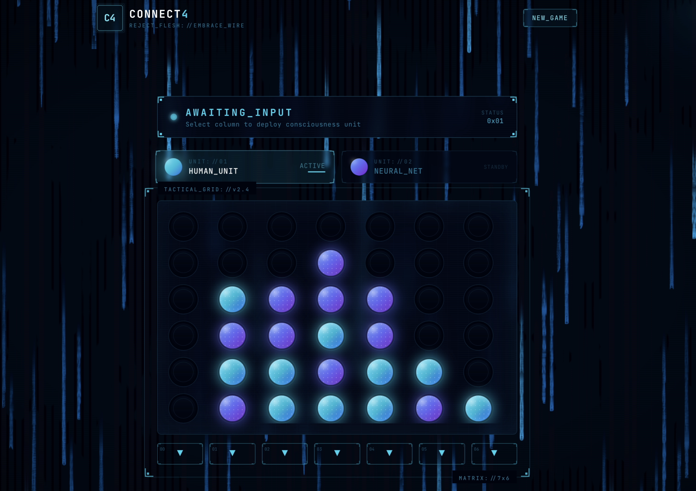

# Connect4 AI with Deep Reinforcement Learning and AWS Deployment

This project implements a Deep Q-Network (DQN) agent to play the game of Connect4. The entire application, including the AI model, a FastAPI backend, and a Streamlit frontend, is containerized with Docker and deployed to AWS using a fully automated CI/CD pipeline and Infrastructure as Code (IaC).

This repository showcases a full, end-to-end project for creating and deploying a sophisticated AI application.

 <!-- Placeholder image -->

## Features

- **Intelligent AI Agent:** A Deep Q-Network (DQN) agent trained with a Convolutional Neural Network (CNN) to learn optimal Connect4 strategies.
- **Robust MLOps:**
    - **Experiment Tracking:** MLflow for logging training metrics, parameters, and model artifacts.
    - **Hyperparameter Tuning:** Optuna for efficient hyperparameter optimization.
    - **Benchmarking:** Evaluation against multiple agents (Random, Rule-Based) to ensure robust performance.
- **Web Application:**
    - **FastAPI Backend:** A high-performance, asynchronous API to serve the model and manage game logic.
    - **Streamlit Frontend:** A clean, interactive, and responsive user interface to play against the AI.
- **Automated Cloud Deployment:**
    - **CI/CD Pipeline:** GitHub Actions for automated testing, Docker image building, and pushing to Amazon ECR.
    - **Infrastructure as Code (IaC):** AWS Cloud Development Kit (CDK) in Python to define and provision all required cloud resources.
    - **Serverless Container Orchestration:** AWS ECS with Fargate for scalable, serverless deployment of frontend and backend containers.
## Tech Stack

- **AI & Machine Learning:** PyTorch, NumPy, Optuna, MLflow
- **Backend:** FastAPI, Gunicorn, Pydantic
- **Frontend:** Streamlit
- **Containerization:** Docker, Docker Compose
- **Cloud & DevOps:**
    - **Cloud Provider:** Amazon Web Services (AWS)
    - **CI/CD:** GitHub Actions
    - **IaC:** AWS CDK (Python)
    - **Services:** Amazon ECS (Fargate), Amazon ECR, Application Load Balancer (ALB), Amazon VPC

## Project Structure

```
.
├── .github/workflows/      # CI/CD pipeline definitions
├── backend/                # FastAPI backend service
│   ├── src/connect4/       # Backend source code
│   ├── tests/              # Backend API tests
│   └── Dockerfile
├── frontend/               # Streamlit frontend service
│   ├── app.py
│   └── Dockerfile
├── infrastructure/         # AWS CDK Infrastructure as Code
│   └── infrastructure/
│       └── infrastructure_stack.py
├── models/                 # Saved model checkpoints
├── src/                    # Core AI, training, and game logic
│   ├── agent/              # Agent definitions (DQN, Random, etc.)
│   ├── game_engine/        # Core Connect4 game logic
│   └── training/           # Training and evaluation logic
├── scripts/                # Scripts for training, tuning, and playing
├── docker-compose.yml      # Local multi-container orchestration
└── README.md
```

## Local Development

### Prerequisites

- Python 3.9+
- Docker and Docker Compose
- An MLflow tracking server (optional, for logging experiments locally)

### Setup

1.  **Clone the repository:**
    ```bash
    git clone https://github.com/<your-username>/Connect4.git
    cd Connect4
    ```

2.  **Set up Python environments and install dependencies:**
    It is recommended to use separate virtual environments for the core ML code and the backend.
    ```bash
    # For main project (training, scripts)
    python -m venv venv
    source venv/bin/activate
    pip install -r requirements.txt

    # For backend
    python -m venv backend/venv
    source backend/venv/bin/activate
    pip install -r backend/requirements.txt
    ```

### Running Locally with Docker Compose

The easiest way to run the full application locally is with Docker Compose. This will build and run the frontend and backend containers and connect them.

1.  **Ensure a trained model exists:**
    Make sure you have a trained model file at `models/best_model.pth`. If not, you can run the training script first:
    ```bash
    python scripts/train.py
    ```

2.  **Build and run the containers:**
    ```bash
    docker-compose up --build
    ```

3.  **Access the application:**
    -   **Frontend:** Open your browser to `http://localhost:8501`
    -   **Backend API Docs:** Open your browser to `http://localhost:8000/docs`

## AI Training & MLOps

### Training the DQN Agent

To run a training session:
```bash
python scripts/train.py --episodes 30000 --lr 0.0001
```
Metrics, parameters, and model artifacts will be logged to the `mlruns` directory by default.

### Hyperparameter Tuning with Optuna

To start a hyperparameter tuning study:
```bash
python scripts/tune.py --n-trials 100
```
This script uses Optuna to find the best hyperparameters and logs the results of each trial to MLflow.

## Cloud Deployment

The deployment is handled by a CI/CD pipeline and AWS CDK.

### Prerequisites

- AWS Account and AWS CLI configured with credentials.
- Node.js and npm (for AWS CDK).
- An existing Amazon ECR repository for the frontend (`connect4-frontend`) and backend (`connect4-backend`).
- GitHub repository secrets configured for AWS credentials to allow the CI/CD pipeline to push to ECR.

### CI/CD Pipeline (`.github/workflows/ci-cd.yml`)

The pipeline automates the following steps on every push to the `main` branch:
1.  **Run Tests:** Executes `pytest` for the backend API.
2.  **Build Docker Images:** Builds the frontend and backend images.
3.  **Push to ECR:** Tags the images with the commit hash and `latest`, then pushes them to Amazon ECR.

### Infrastructure Deployment with AWS CDK

1.  **Set up the CDK environment:**
    ```bash
    cd infrastructure
    npm install -g aws-cdk
    python -m venv .venv
    source .venv/bin/activate
    pip install -r requirements.txt
    ```

2.  **Bootstrap CDK (One-time setup):**
    If this is your first time using CDK in this AWS account/region, you need to bootstrap it.
    ```bash
    cdk bootstrap
    ```

3.  **Deploy the Stack:**
    This command synthesizes the Python code into a CloudFormation template and deploys the resources.
    ```bash
    cdk deploy
    ```
    The output will include the public URL of the Application Load Balancer.

### Destroying the Infrastructure

To avoid ongoing AWS charges, you can destroy all the created resources with a single command.
```bash
# From the infrastructure directory
cdk destroy
```

